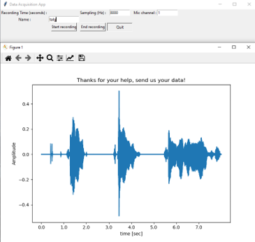
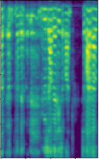
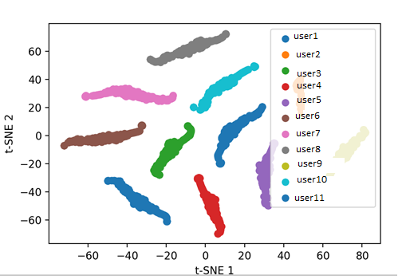

## audio_id
Course project on continuous audio signal monitoring including collection, processing, and authentication.  Deep Learning approach for audio-based user authentication.

## Project Flow

The goal of this project is to utilize mel coefficient features and deep learning for user authentication by voice analysis.
We implement various temporal-spectral features with no prior knowledge and learn the best features for this task:

1) Collect sound data with the data_acq_gui script.

     

2) Perform feature analysis to analyze quality of various sound features

     

3) Build a CNN model optimizing all possible combinations of features to detect the best feature combination 
4) Train a CNN and save weights
5) Evaluate the CNN with ROC and PRC curves, measure AUC, and evaluate various working points (max sensitivity, max specificity, max accuracy)

     

